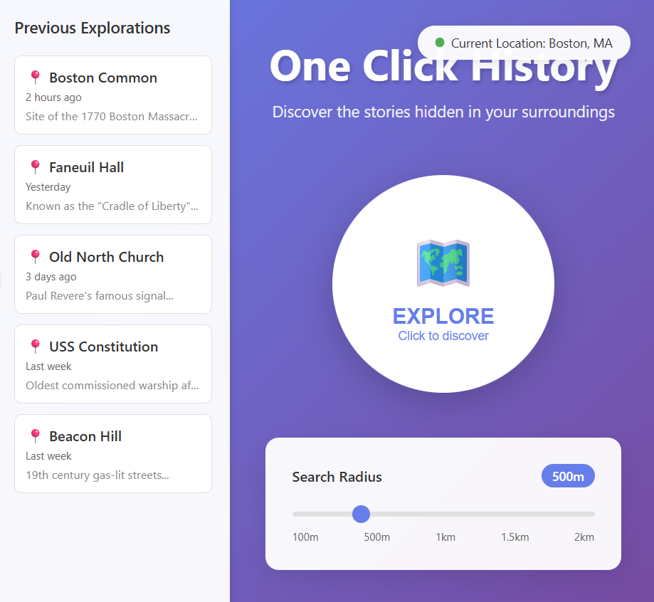
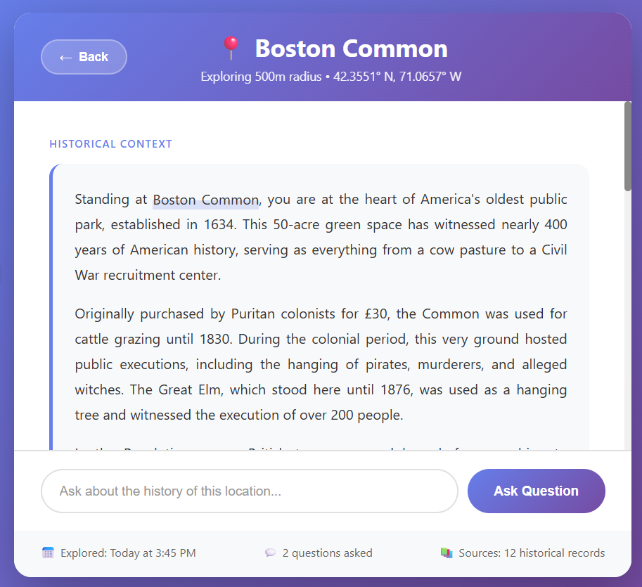

# Problem Statement

## Domain: Local Historical Context

This domain focuses on understanding the historical context of the location that I am standing in exactly that moment. When I walk around outside, I often wonder why things are the way they are–why is the bridge so tall, why is the mountain so rugged, etc–and I'd love to solve a problem within this domain because doing so answers those questions.

## Problem: Finding local historical context

The problem is that people often struggle to find historical context for where they are. It often requires strenuous web search or walking around and looking for signs explaining things. There is no one button way to get the context of where you are.

## Stakeholders

**Curious pedestrians, locals, and tourists** - People walking around cities or nature who wonder about the history of places they pass but lack easy access to that information.

**Local historians and heritage organizations** - Experts and institutions who possess valuable historical knowledge but lack effective platforms to share it with the public.

## Evidence and Comparables

**Popular Mobile Apps for Finding Local History** (https://www.familysearch.org/en/blog/popular-mobile-apps-for-finding-local-history) - Professional genealogist Amy Johnson Crow explaining the critical need to understand historical context of locations, with apps like Field Trip providing location-based history.

**Heritage Tourism Guidebook | Texas Historical Commission** (https://thc.texas.gov/preserve/tourism-and-economic-development/heritage-tourism/heritage-tourism-guidebook) - Report showing 81% of U.S. travelers are "cultural tourists" and 56% included heritage activities in 2017.

**History Near You comparable** (https://apps.apple.com/us/app/history-near-you/id1626904412) - iOS app with 160,000+ historical sites providing GPS-based notifications when near historical locations across all 50 U.S. states.

**Explore the history of your current location with HistoryPin for Android comparable** (https://thenextweb.com/news/history-in-your-pocket-with-historypins-new-android-app) - HistoryPin app using phone cameras to overlay historical photos on current views, showing augmented reality potential for location-based history.

**Observation**- recently I was in the Maine wilderness, and was wondering about the history of the tribes that used to live there. In order to figure it out, I'd have to go online and manually search it up, knowing what to look for. This is a lot of friction to getting the knowledge I'd like.

# Application Pitch

**Name:** One Click History

**Motivation:** The problem being solved is that there is too much friction for people to find out the historical context of where they are actively standing.

**Key Features:** The main screen will be a button, a radius slider, and a previous searches sidebar. The user can use the slider to choose a radius for their historical context. When a user presses the button, a LLM will provide the user with location aware historical context within the radius that they've chosen and the user will be on a new page that has a text entry where they can ask questions about the historical context they've been given. The LLM will also assign a "main location" for the chat and this will be displayed as a marker for the chat in the initial sidebar mentioned above. This helps to mitigate the problem because users can get accurate historical context of their surroundings in one click, removing as much friction as possible. This would enable pedestrians, locals, and tourists to more easily view the history of their surroundings and it would help historians and heritage organizations have their web-published historical knowledge get seen more.

# Concept Design

## Concept LocationChatLedger
**Purpose:** preserve location-based historical explorations for future reference  
**Principle:** after creating a chat for a location with radius, user can retrieve it later to continue exploration or review past discoveries

**State:**
- A set of Chats with:
  - An id String
  - A user User
  - A centerLocation Coordinates (lat, lng)
  - A radius Number (in meters)
  - A mainLocation String (descriptive name)
  - A createdAt DateTime
  - A context String (initial historical context)
  - A messages list of Message (question/answer pairs)

**Actions:**
- `createChat(user: User, location: Coordinates, radius: Number): (chatId: String)`
  - Requires: user is authenticated
  - Effects: Creates new chat c with c.user=user, c.centerLocation=location, c.radius=radius, generates unique id, sets c.createdAt to current time, initializes empty messages list
  - Returns: chat id
- `setContext(chatId: String, context: String, mainLocation: String)`
  - Requires: chat with chatId exists
  - Effects: Sets chat.context=context and chat.mainLocation=mainLocation
- `addMessage(chatId: String, question: String, answer: String)`
  - Requires: chat with chatId exists
  - Effects: Appends new Message(question, answer) to chat.messages
- `getUserChats(user: User): (chats: List<Chat>)`
  - Requires: user is authenticated
  - Effects: Returns all chats where chat.user=user, sorted by createdAt descending
- `getChat(chatId: String, user: User): (chat: Chat)`
  - Requires: chat exists with chatId and chat.user=user
  - Effects: Returns the chat

## Concept HistoricalContextAgent
**Purpose:** generate location-aware historical narratives  
**Principle:** given a location and radius, synthesize relevant historical information into engaging context; answer follow-up questions grounded in that context

**State:**
- A set of ActiveContexts with:
  - A sessionId String
  - A baseContext String (the generated historical narrative)
  - A location Coordinates
  - A radius Number

**Actions:**
- `generateContext(location: Coordinates, radius: Number): (context: String, mainLocation: String, sessionId: String)`
  - Requires: valid coordinates and positive radius
  - Effects: Queries historical sources for location within radius, generates narrative context, identifies most significant location as mainLocation, creates ActiveContext with new sessionId
  - Returns: context narrative, main location name, session id
- `answerQuestion(sessionId: String, question: String): (answer: String)`
  - Requires: ActiveContext exists with sessionId
  - Effects: Generates answer based on baseContext and question
  - Returns: answer grounded in historical context
- `clearSession(sessionId: String)`
  - Requires: ActiveContext exists with sessionId
  - Effects: Removes ActiveContext from set

## Concept LocationAwareness
**Purpose:** detect and validate user location for context requests  
**Principle:** when user requests historical context, capture their current location or use manually selected location; validate location is within serviceable area

**State:**
- A set of LocationRequests with:
  - A requestId String
  - A location Coordinates
  - A timestamp DateTime
  - A radius Radius
  - A source String (GPS/manual)

**Actions:**
- `captureLocation(): (location: Coordinates, radius: Radius, requestId: String)`
  - Requires: user grants location permission or manually selects location
  - Effects: Gets current GPS coordinates or manual selection, creates LocationRequest with timestamp and source, stores in set, sets radius as Radius
  - Returns: location coordinates and request id
- `validateLocation(location: Coordinates): (valid: Boolean, message: String)`
  - Requires: location coordinates provided
  - Effects: Checks if location is within supported geographic boundaries, checks if sufficient historical data exists for area
  - Returns: validation status and explanatory message
- `adjustRadius(location: Coordinates, requestedRadius: Number): (adjustedRadius: Number)`
  - Requires: valid location
  - Effects: Adjusts radius based on urban/rural density and available historical data
  - Returns: optimized radius for the location

```
sync requestHistoricalContext 
when 
User.clickExplore(radius)
then
LocationAwareness.captureLocation(): (location, radius, requestId)
LocationAwareness.validateLocation(location): ()

sync getHistoricalContext
when
LocationAwareness.captureLocation(): (location, radius, requestId)
LocationAwareness.validateLocation(location): (valid: true)
then
LocationChatLedger.createChat(user, location, adjustedRadius): (chatId) 
HistoricalContextAgent.generateContext(location, adjustedRadius): (context, mainLocation, sessionId) 
LocationChatLedger.setContext(chatId, context, mainLocation)


sync askFollowUpQuestion
when 
User.askQuestion(chatId, question)
then 
LocationChatLedger.getChat(chatId, user): (chat) HistoricalContextAgent.answerQuestion(chat.sessionId, question): (answer) LocationChatLedger.addMessage(chatId, question, answer)


sync revisitPastExploration
when
User.selectPreviousChat(chatId)
then
LocationChatLedger.getChat(chatId, user): (chat)


sync loadChatHistory
when User.openApp()
then LocationChatLedger.getUserChats(user): (chats)
```

**LocationChatLedger** acts as the persistent memory of the application, storing all user explorations. Each chat captures not just the location and radius, but also the full conversation history, allowing users to revisit and continue past explorations. The "mainLocation" field enables the sidebar display of previous searches as meaningful landmarks rather than abstract coordinates.

**HistoricalContextAgent** provides the intelligence layer, generating rich historical narratives and maintaining context for follow-up questions. By keeping active sessions separate from stored chats, we allow for both immediate interaction and long-term preservation. The agent is designed to be stateless between sessions but maintains context within a session for coherent Q&A.

**LocationAwareness** handles the critical location capture and validation, ensuring users get relevant results. The radius adjustment feature intelligently adapts to data density - expanding in rural areas with sparse historical records and tightening in dense urban areas with rich history. This concept could easily extend to support features like location search or favorite locations.

The generic User type is bound to an authentication system (not shown) that would control access to chats. The Coordinates type represents standard latitude/longitude pairs. The synchronizations ensure that location validation happens before expensive context generation, and that all interactions are properly persisted for future reference.

This design prioritizes minimal friction while maintaining rich functionality for those who want to dig deeper into local history.

# UI Sketches, iteratively built using AI.

**Main screen:**



**Exploration screen:**



# User Journey:

Sarah walks past an old brick building every morning, always wondering about its faded lettering and unique architecture. Today, stopped at a crosswalk, she opened One Click History on her phone. The main screen shows a prominent "EXPLORE" button with her previous explorations in the sidebar. She adjusts the radius slider from 500m down to 200m and taps EXPLORE.

The exploration page instantly reveals she's near the old Boston Manufacturing Company building, with paragraphs explaining how this was the heart of America's 1840s textile revolution and site of a famous labor strike. Intrigued, she scrolls through the historical context and asks in the text box: "What happened to the mill workers after the factory closed?" The answer appears as a chat bubble below her question. She asks one more question about the faded lettering—it's the original 1841 company sign.

The next morning, her commute feels different. The building is no longer just old brick and mystery but a piece of history she understands. She sees "Boston Manufacturing Company" saved in her sidebar, ready to explore further whenever she wants. Her daily walk has transformed from routine to discovery, accessible with literally one click.